# 3. Words & transducers

**Finite-state transducers**

- Porter stemmer

- Tokenization, word segmentation

- Minimum edit distance

## 3.1 MORPHOLOGY

*morpheme:* The minimal meaning-bearing unit in a language.
  - **stems:** main meaning
  - **affixes:** additional meanings
    - prefixes
    - suffixes
    - infixes
    - circumfixes

### 3.1.1 Inflectional Morphology

1. plural
2. possessive

### 3.1.2 Derivational Morphology

-ation
-ee
-er
-ness

### 3.1.3 Cliticization

proclitics
enclitics

### 3.1.4 Non-concatenative Morphology

non-concatenative morphology
templatic morphology / root-and-pattern

### 3.1.5 Agreement

## 3.2 FINITE-STATE MORPHOLOGICAL PARSING

N : noun
Sg : singular
Pl : plural

1. **lexicon:** thelistofstemsandaffixes
2. **morphotactics:** the model of morpheme ordering that explains which classes of morphemes can follow other classes of morphemes inside a word
3. **orthographic rules:** these spelling rules are used to model the changes that occur in a word, usually when two morphemes combine (e.g., the y → ie spelling rule discussed above that changes city + -s to cities rather than citys).

## 3.3 BUILDING A FINITE-STATE LEXICON

finite-state automaton

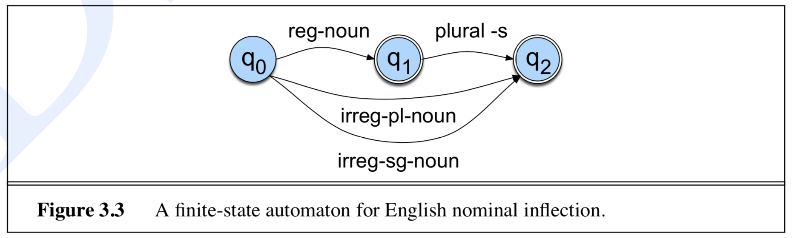

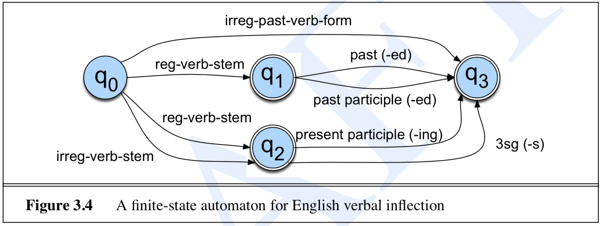

# 3.4 FINITE-STATE TRANSDUCERS

**Finite state transducers:** a type of finite automaton which maps between two sets of symbols.

- **FST as recognizer:** a transducer that takes a pair of strings as input and outputs accept if the string-pair is in the string-pair language, and reject if it is not.
- **FST as generator:** a machine that outputs pairs of strings of the language. Thus the output is a yes or no, and a pair of output strings.
- **FST as translator:** a machine that reads a string and outputs another string.
- **FST as set relater:** a machine that computes relations between sets.

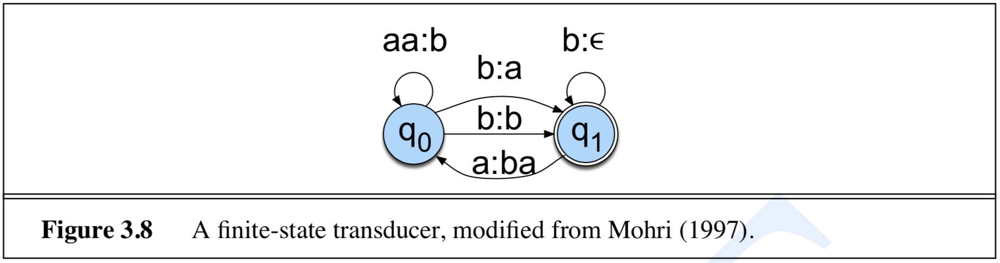

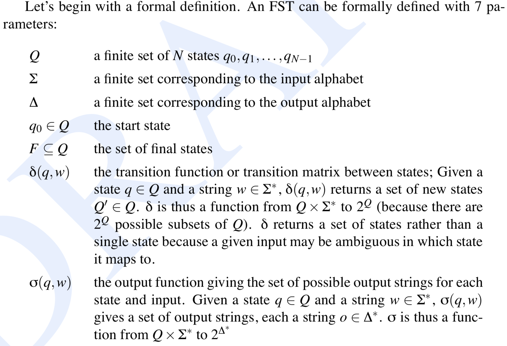

**Regular relations** are sets of pairs of strings, a natural extension of the regular languages, which are sets of strings.

### 3.4.1 Sequential Transducers and Determinism

**Sequential transducers** by contrast, are a subtype of transducers that are deter- ministic on their input.

A p-subsequential transducer allows for p(p ≥ 1) final output strings to be associated with each final state (Mohri, 1996).

## 3.5 FSTS FOR MORPHOLOGICAL PARSING

**finite-state morphology** paradigm: represent a word as a correspondence between a **lexical level**, which represents a concatenation of mor- phemes making up a word, and the **surface level**, which represents the concatenation of letters which make up the actual spelling of the word

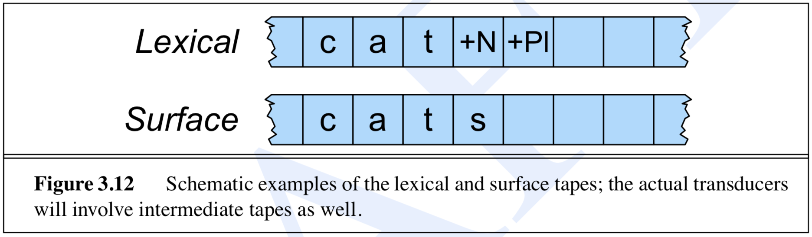

View an FST as having two tapes: 
1. **upper** or **lexical** tape: is composed from characters from one alphabet Σ
2. **lower** or **surface** tape: is composed of characters from another alphabet ∆.

In two-level morphology, the pairs of symbols in Σ′ are also called **feasible pairs**.

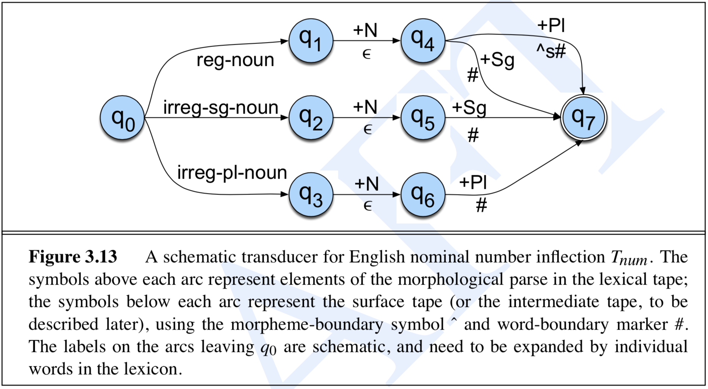

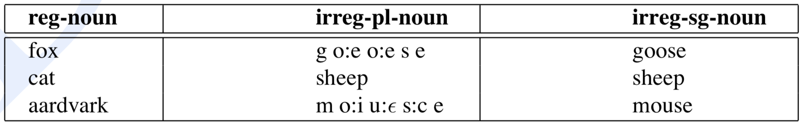

## 3.6 TRANSDUCERS AND ORTHOGRAPHIC RULES

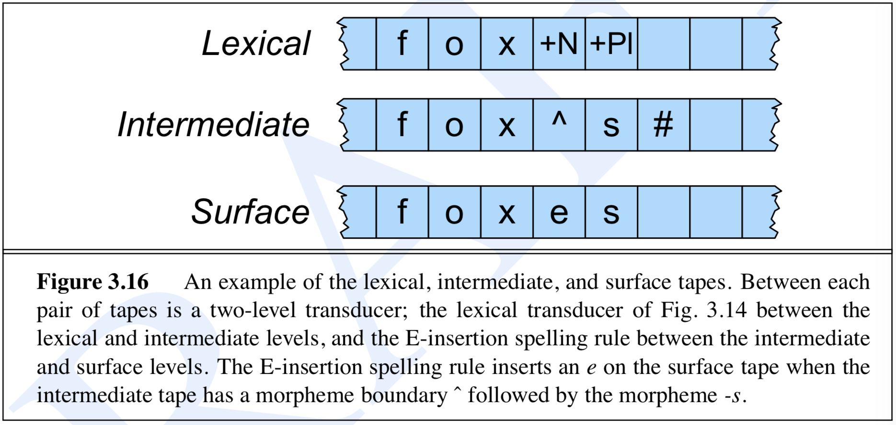

## 3.7 COMBINING FST LEXICON AND RULES

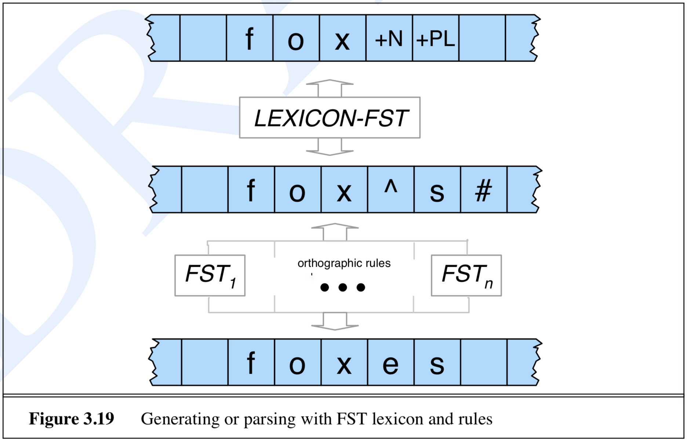

## 3.8 LEXICON-FREE FSTS: THE PORTER STEMMER

## 3.9 WORD AND SENTENCE TOKENIZATION

State-of-the-art methods for sentence tokenization are based on machine learning and will be introduced in later chapters.

### 3.9.1 Segmentation in Chinese

## 3.10 DETECTING AND CORRECTING SPELLING ERRORS

1. non-word error detection
2. isolated-word error correction
3. context-dependent error detection and correction

non-probabilistic minimum edit distance

## 3.11 MINIMUM EDIT DISTANCE

The minimum edit distance is computed by dynamic programming.

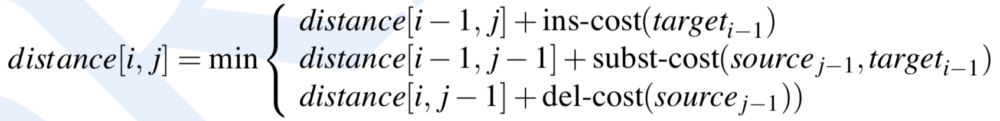

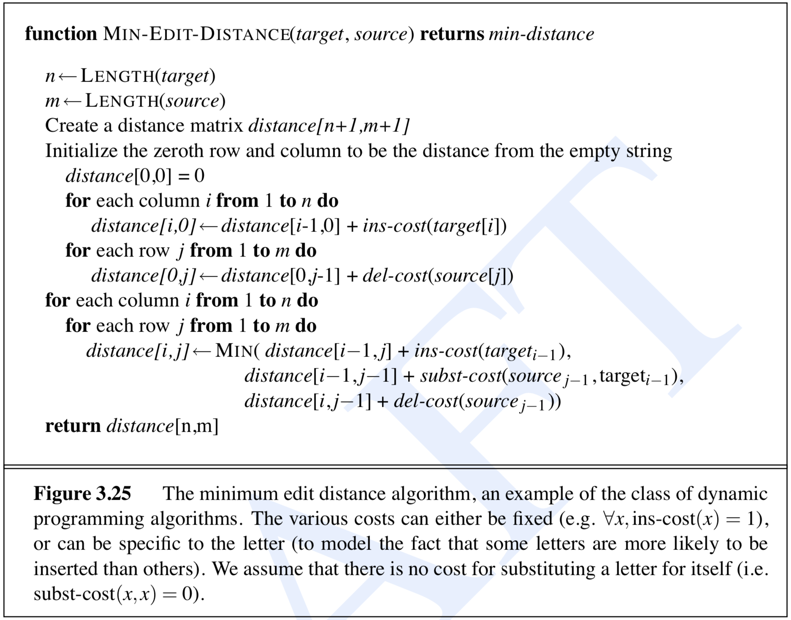
