# 4. N-GRAMS

**language models(LMs)**

## 4.1 COUNTING WORDS IN CORPORA

A lemma is a set of lexical forms having the same stem, the same major part-of-speech, and the same word-sense.

The wordform is the full inflected or derived form of the word.

## 4.2 SIMPLE (UNSMOOTHED) N-GRAMS

## 4.3 TRAINING AND TEST SETS

## 4.4 EVALUATING N-GRAMS: PERPLEXITY

An **intrinsitic evaluation** metric is one which measures the quality of a model independent of any application.

**Perplexity** is the most common intrinsic evaluation metric for N-gram language models.

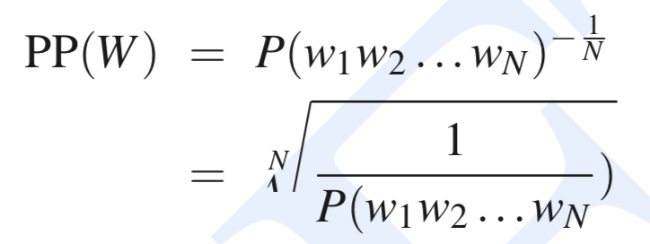

There is another way to think about perplexity: as the **weighted average branching factor** of a language.

The branching factor of a language is the number of possible next words that can follow any word.

## 4.5 SMOOTHING

**Laplace Smoothing**

### 4.5.2 Good-Turing Discounting

A word or N-gram (or any event) that occurs once is called a **singleton**, or a **hapax legomenon**.

We refer to the number of N-grams that occur *c* times as the frequency of frequency *c*.

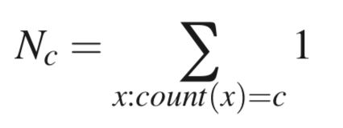

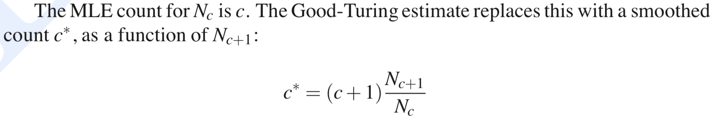

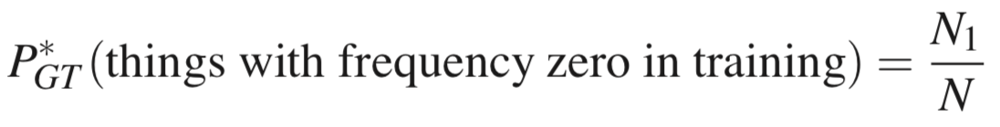

### 4.5.3 Some advanced issues in Good-Turing estimation

## 4.6 INTERPOLATION

There are two ways to use this N-gram "hierarchy", **backoff** and **interpolation**. 

In backoff, if we have non-zero trigram counts, we rely solely on the trigram counts. We only “back off” to a lower order N-gram if we have zero evidence for a higher-order N-gram.

By contrast, in interpolation, we always mix the probability estimates from all the N-gram estimators, i.e., we do a weighted interpolation of trigram, bigram, and unigram counts.

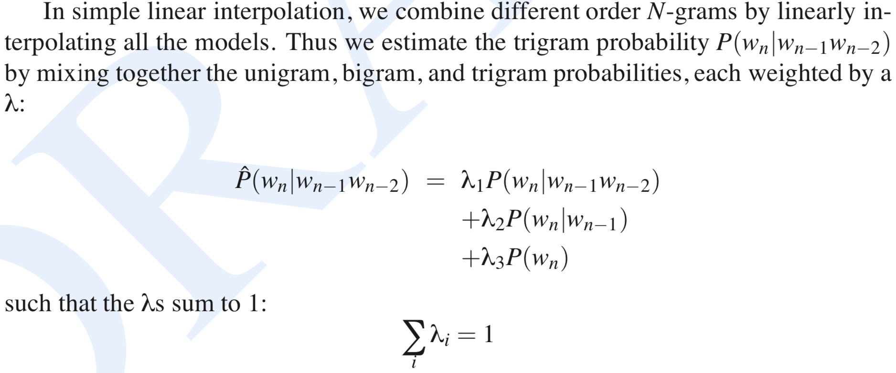

## 4.7 BACKOFF

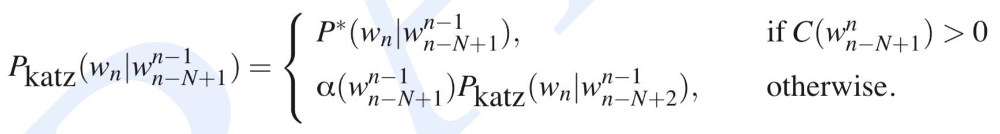

the trigram version of backoff

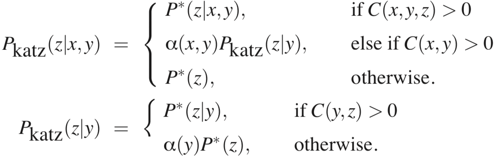

## 4.9 ADVANCED ISSUES IN LANGUAGE MODELING

### 4.9.1 Advanced Smoothing Methods: Kneser-Ney Smoothing

Kneser-Ney has its roots in a discounting method called absolute discounting.

Absolute discounting formalizes this intuition, by subtracting a fixed (absolute) discount d from each count. The intuition is that we have good estimates already for the high counts, and a small discount d won’t affect them much.

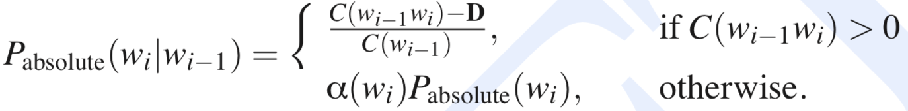

**Kneser-Ney discounting** (Kneser and Ney, 1995) augments absolute discounting with a more sophisticated way to handle the backoff distribution.

The Kneser-Ney intuition is to base our estimate on the number of different contexts word w has appeared in.

Words that have appeared in more contexts are more likely to appear in some new context as well. We can express this new backoff probability, the “continuation probability”, as follows:

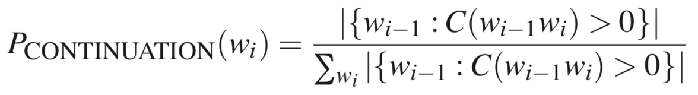

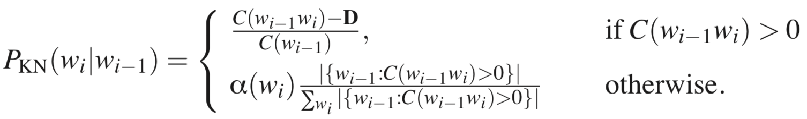

### 4.9.2 Class-based N-grams

The **class-based** N-gram or **cluster** N-gram is a variant of the N-gram that uses information about word classes or clusters.

The simplest one is sometimes known as **IBM clustering**. IBM clustering is a kind of **hard clustering**, in which each word can belong to only one class.

### 4.9.3 Language Model Adaptation and Using the Web

**Adaptation**: We can train on the larger out-of-domain dataset and adapt our models to the small in-domain set.

### 4.9.4 Using Longer Distance Information: A Brief Summary

## 4.10 ADVANCED: INFORMATION THEORY BACKGROUND

We could define the entropy rate (we could also think of this as the per-word entropy) as the entropy of this sequence divided by the number of words:

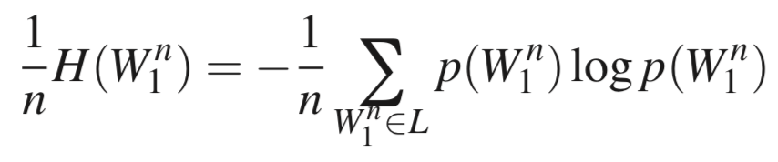

If we think of a language as a stochastic process *L* that produces a sequence of words, its entropy rate H(*L*) is defined as:

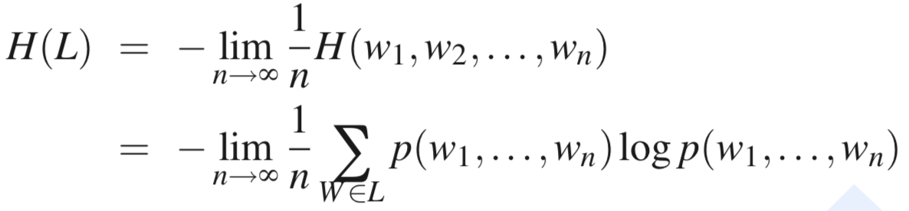

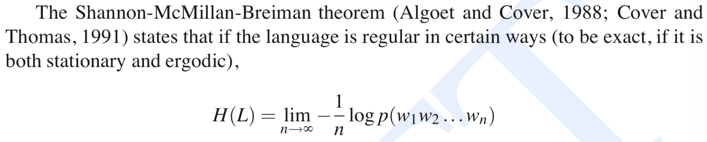

That is, we can take a single sequence that is long enough instead of summing over all possible sequences.

Markov models, and hence N-grams, are stationary.

### 4.10.1 Cross-Entropy for Comparing Models

The cross-entropy of m on p is defined by:

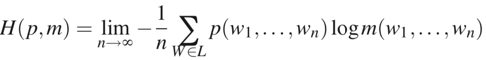

**perplexity**

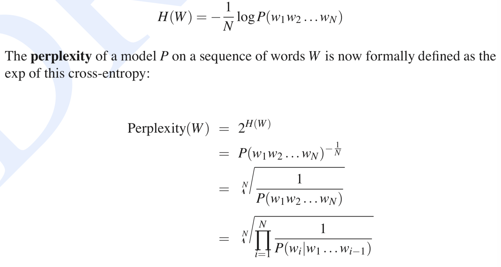

## 4.11 ADVANCED: THE ENTROPY OF ENGLISH AND ENTROPY RATE CONSTANCY

The cross-entropy of some model m can be used as an upper bound on the true entropy of some process. 
